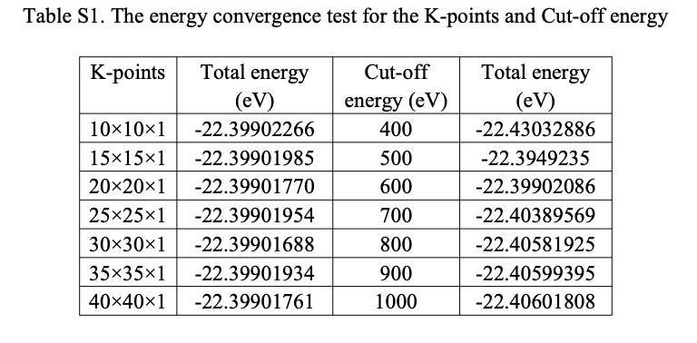

## A 2D Rashba electron gas with large spin splitting in Janus structures of SnPbO2
### Phys.Chem.Chem.Phys.,2020,22,11409--11416

- the projected-augmented-wave (PAW) method
- The valence configurations of Sn, Pb and O atoms considered in the calculations are 5s$^2$5p$^2$, 6s$^2$6p$^2$, and 2s$^2$2p$^4$
- The Kohn–Sham orbitals were expanded in a plane-wave basis with a kinetic energy cutoff of 800 eV
- the exchange–correlation functional was treated by the Perdew–Burke–Ernzerhof (PBE) form generalized gradient approximation (GGA)
- The brillourin zone (BZ) was sampled with 30 􏰀 30 􏰀 1 Monkhorst–Pack k-point
- The convergence threshold for the self-consistent field (SCF) energy is set at 10􏰁6 eV
- all atomic positions are fully optimized until the Hellman–Feynman forces are smaller than 0.001 eV Å$^{-1}$
-  As shown in Table S1 , the total energy is converged at 10$^{-5}$ eV level

## Giant tunable Rashba spin splitting in a two-dimensional BiSb monolayer and in BiSb/AlN heterostructures
### PHYSICAL REVIEW B 95, 165444 (2017)

- carried out using the projec- tor augmented-wave (PAW) method as implemented in the VASP code 
- used the PBE exchange-correlation functional as parametrized by Perdew-Burke-Ernzerhof
- The SOC was employed by a second-variation method implemented in the VASP code.
- considered 15 valence electrons of Bi (5d$^{10}$6s$^2$6p$^3$) and 5 valence electrons of Sb (5s$^2$5p$^3$) in the PAW pseudopotential.
- The lattice parameters of the monolayer were optimized until the Hellmann-Feynman residual forces were less than 10$^{−4}$ eV/Å per atom.
-  For convergence of the electronic self-consistent calculations, a total energy difference criterion was defined as 10$^{−8}$ eV.
-   used 650 eV as the kinetic energy cutoff of the plane wave basis set and a 􏰂-type 10 × 10 × 1 k-point mesh was employed to optimize the lattice parameters and the self-energy. 
-   The phonon calculations were performed for a 4 × 4 × 1 supercell using the density functional perturbation theory (DFPT) approach as implemented in the VASP code.
-   To verify the stability of the BiSb monolayer at room temperature, we performed room temperature molecular dynamics (MD) simulations for more than 6000 fs with a time step of 1 fs. In MD simulations, we employed a supercell of size 4 × 4 × 1 to guarantee the decay of interatomic force constants within the supercell dimensions
-   The Bi- and Sb-terminated BiSb/AlN heterostructures were modeled by using supercells of size (3 × 3 × 1)/(4 × 4 × 1). 
-   The heterostructures were optimized until the total residual forces on each atom were less than 0.001 eV/A. A􏰂 $\Gamma$ -point mesh of size 8×8×1 was used to sample the irreducible Brillouin zone of the heterostructures.
-   A vacuum of thickness larger than 15 A was added along the c axis to avoid any interaction between two periodic BiSb and BiSb/AlN geometries.
-   The PYPROCAR code was used to calculate the constant energy contour plots of the spin texture